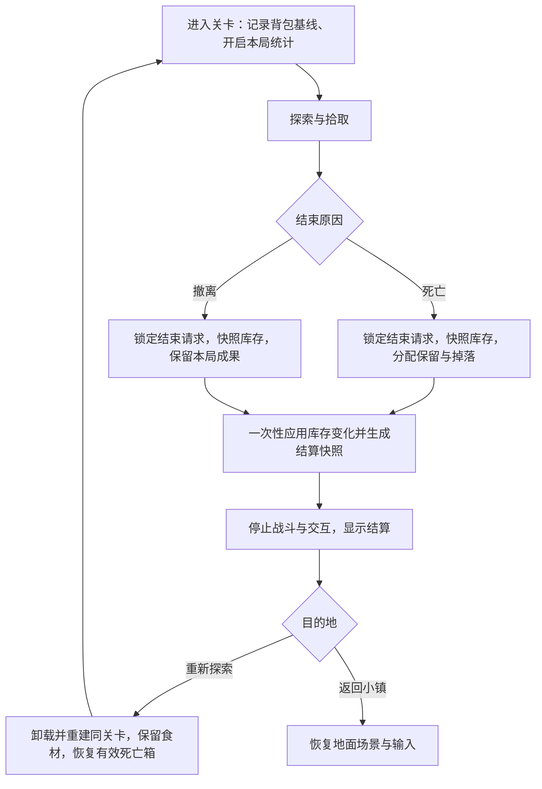

# Timer 制作计划：死亡掉落与舔包、结算界面

更新：2026-09-09。阶段：批次 1-5 的开发已实现；最终验证和交付证据见综合验收记录。需求提出人的人工签收与云端看板状态独立处理。

实现记录见 [第一批实施记录](timer-batch1-implementation.md)。
第二批见 [结束流程与基础结算界面](timer-batch2-implementation.md)。
第三批见 [死亡保留与跨局舔包](timer-batch3-implementation.md)。
最终交付见 [完整结算界面与综合验收](timer-final-acceptance.md)。

## 1. 目标与依据

- [需求看板](https://jcnllikprxkk.feishu.cn/wiki/TcmdwG7iNiAwEwkkxhzccM0fnHc)：Timer 负责“【开发】死亡掉落与舔包”“【开发】结算界面制作”，两项优先级均为 P1，提出人为鸣泣。
- [局内战斗设计](https://jcnllikprxkk.feishu.cn/wiki/K77mwxv3PikPR3kMentctk1YnXg?sheet=0nADzq)：死亡需求位于“二、背包 / 3、死亡掉落与舔包”；结算需求位于“三、局内战斗 / 1、结算界面”。
- [7.20局内战斗UI需求](https://jcnllikprxkk.feishu.cn/wiki/LGhLwWc0MidiR6kOCpocuIubnog)：第 2 节给出结算原型、背包布局和结果显示要求。
- 2026-09-08 用户明确选择：**按云文档制作，食材占背包格，连续探索保留背包**。当前工程的“新食材无格数限制、每局清空”不是目标规则。

交付目标：玩家死亡或撤离后进入结算；死亡会正确分配保留物与掉落物；同关卡再探索可找回死亡箱；结算准确展示当局结果，并可继续探索或返回地面。

## 2. 当前工程与差异

检查基线：本地仓库 HEAD `4c51cb22`，初始工作区干净。以下路径相对于 `extraction-shooter/UnityProject/ExtractionShooter`。

| 模块 | 已有基础 | 本次需要调整 |
| --- | --- | --- |
| `Assets/Scripts/3C/TopDownController.cs:529` | 死亡动画、停止移动/射击 | 当前直接清空背包和局内袋、随机生成预设掉落、1 秒后回家；改为统一结束流程 |
| `Assets/Scripts/ItemInteration/levelCaveCar.cs:46` | 撤离点范围检测与 E 交互 | 当前直接回家；改为请求撤离结算 |
| `Assets/Scripts/Manager/LevelManager.cs:114` | Additive 关卡加载、回城与转场表现 | 接入结算后的目的地选择；补同关卡卸载重进；移除结束路径重复资源提交 |
| `Assets/Scripts/Bag/InventoryManager.cs:39` | 已解锁槽位、堆叠、无格本局字典 | 食材统一占格；补快照和批量装载结果；连续探索保留食材 |
| `Assets/Scripts/Bag/InventoryManager.cs:661` | 旧百分比清包方法 | 旧方法按格子数清除，不符合按资源数量保留的要求，不能直接复用 |
| `Assets/Scripts/ItemInteration/LootCollector.cs:5` | 三种入库路径、吸附与拾取反馈 | 按明确的资源配置分流食材/采集物；死亡箱使用独立多物品数据 |
| `Assets/Scripts/Manager/GameValManager.cs:44` | 资源类型、名称、图标、总量与事件 | 复用查询和永久资源接口；补齐本需求需要的分类映射与价值配置 |
| `Assets/Scenes/UpGround.unity:63147` | 常驻 `MainUI`、UGUI、1920x1080 CanvasScaler | 复用素材；结算实际挂到常驻 RunSessionManager 下，保持独立 Overlay Canvas 和输入系统 |
| `Assets/Prefabas/SceneItem/BagItem.prefab` | 背包格外观、图标与数量显示 | 结算复用美术，使用只读快照视图，不能复制库存管理器 |

现有槽位数据由 `InventoryItemUI` 持有。本次先为现有库存补快照/批量操作接口，不扩大为全项目背包架构重写。

## 3. 目标数据与流程

### 3.1 数据分工

| 数据 | 负责内容 | 生命周期 |
| --- | --- | --- |
| 食材背包 | 槽位、类型、堆叠数量、格容量 | 沿用现有背包；连续探索保留，死亡按规则减少 |
| 本局采集物 | 本局实际获得的采集物，包含舔包取回部分 | 每局重新计数；不占食材格，结束时只处理一次 |
| 本局记录 | 关卡标识、开始时食材快照、有效游玩时长、击杀、新宠物/菜谱 | 每次真正进入新一局时建立 |
| 结算快照 | 结束原因、最终背包、食材净变化、本局采集物及结算后总量、首次解锁、统计 | 结束时固定，界面只读，不随实时库存重新计算 |
| 死亡箱记录 | 箱子标识、关卡标识、位置、食材/采集物清单、领取状态 | 跨场景保留；新死亡替换，换关卡清除，领取后清除 |

复用 `RunIngredientStore` 已有字典与快照能力作为改造基础；先核实所有资源的实际定义，再调整调用口径，不能仅凭 ingredient、plant 或 Food 等旧命名分类。不要修改已有 `ResourceType` 枚举数值。

### 3.2 结束一次且只结束一次

- 结束请求需要独立状态，阻止死亡、E 撤离、按钮连点导致重复执行。死亡分配发生在任何清空、资源转移和场景卸载之前。
- 结算按钮只选择目的地，不再次发奖励或扣库存。退出关卡两个现有路径不能继续各自提交一次资源。
- 建议在生成最终结果时一次性结清本局采集物，并记录提交后的永久总量；下一局只对新获得和舔包取回的采集物承担死亡损失，不能扣掉历史仓库资源。
- 食材继续以现有背包为准，不能在回城时既保留背包又重复加到永久仓库。
- 结算期间禁用移动、射击、拾取、撤离和饥饿消耗。若暂停时间缩放，UI 动画及必要转场使用不受时间缩放影响的更新，点击后恢复正确状态。
- 重新探索需要真正卸载并重建同关卡，重置玩家死亡状态、饥饿/弹药、敌人和当局统计，不能调用会销毁全部常驻对象的全局重开方法。

## 4. 制作批次

### 批次 1：资源与本局数据

状态：已完成。实际首次解锁入口、背包/拾取组件、本局数据与关卡生命周期已接通；连续探索按钮及完整结算流程属于后续批次。

- 列出实际拾取物配置，逐项确认哪些是占格食材、无格采集物、直接永久资源；修正当前“植物默认进无格食材袋”的路由。
- 为现有背包补读取/应用槽位快照接口，保留原本同类堆叠行为，单次加物返回实际接收量和剩余量。
- 建立本局记录，入场保存食材基线，退出前取得最终快照；食材净变化使用最终数减入场数。
- 建立时长、真实怪物死亡、实际拾取与首次解锁的统计入口。击杀不能以对象销毁计数，避免卸载场景时虚增。
- 保留历史永久采集物与本局新增采集物的界限，准备 HUD“总量 + 当局变化”刷新接线。
- 门槛：食材正确占格；满包不吞物品；采集物不占格；开始第二局时食材保留、本局统计清零。

### 批次 2：统一结束流程与功能版结算

状态：已实现。死亡/撤离使用同一结束入口；基础面板、重新探索、回城及失败恢复已接通。第二批的临时全损策略已由第三批替换为比例分配与死亡箱。

- 新增单一的本局结束控制入口，死亡和 E 撤离均调用该入口。
- 将死亡库存处理集中到统一入口，取消随机预设掉落及强制延时回城；比例分配在批次 3 替换当前临时全损策略。
- 引入独立结算状态，生成只读结果快照；用基础面板先接通“重新探索”“返回小镇”。
- 为 LevelManager 增加同关卡重进路径；显式传递关卡标识，不依赖易变化的活动场景名称。
- 清理原退出路径重复入库职责，结算时冻结玩法，离开面板后恢复正确的输入/数值状态。
- 门槛：死亡与撤离均停在结算；两个按钮可用；连续点击不会重复奖励或切场景；重进后角色可正常行动。

### 批次 3：死亡分配与死亡箱

状态：已完成并通过真实关卡和故障注入测试。采用按类型取整、当前商店单价排序、溢出食材丢弃；箱子在本次游戏运行内跨局保存。

- 将死亡保留/掉落计算做成可独立验证的逻辑，输入资源快照与保留比例，输出保留清单和掉落清单。
- 默认保留 10%，向上取整；为技能树提供明确的保留比例字段和接线点。属性编号须与维护技能配置的人对齐，不能随意占用。
- 生成单个死亡箱数据记录，在关卡加载完成后恢复箱子实体；实体挂在正确关卡中，记录保留在本局管理服务中。
- 实现未舔包再次死亡替换旧箱、舔包资源纳入当局统计、进入其他关卡清除旧箱。
- 批量舔包：先全收采集物；对所有食材先填已有同类堆叠，再按价值从高到低分配空格。不能按箱子遍历顺序边加边吞余量。
- 领取只生效一次；空箱直接清理；满包按确认后的丢弃口径处理，并给出必要的拾取反馈。
- 复用吸附/音效/粒子表现，死亡箱独立于普通掉落物的超时闪烁与自动销毁。
- 门槛：跨局找回、连续死亡、换图、满包四类边界都通过；保留量与掉落量之和等于原数量。

### 批次 4：完整结算 UI 与资源接入

状态：已实现。复用现有木框纸面底板和项目美术，接入真实木材/宠物模型生成的图标、NEW 徽标、固定统计区与完整死亡明细。

- `SettlementPanel.prefab` 挂到常驻 RunSessionManager 下作为独立 Overlay Canvas，避免关卡相机销毁后丢失画面。复用项目 UGUI、字体、背包边框、食材图标与按钮风格。
- 左侧背包只读显示所有已拥有格子及空格，适配 1、2、4、6、9、12 格；排除现有 HUD 额外展示的锁定预览格。
- 右侧按新宠物、新菜谱、采集物、食材净变化、冒险时长排列；未获得的资源类别隐藏并自动上移。
- 新宠物/菜谱按本局“未拥有到拥有”记录显示 NEW，不把重复拾取当新解锁。
- 采集物显示本局实际获得量和当前总量，死亡额外显示携出/遗失；总量包含永久仓库及尚未入库部分，使用 long 防止相加溢出。食材净变化允许负数，负值红字；时长和大数量完整显示。
- 接入两个目的地按钮的正常、悬停、按下、切换中禁用状态；结算期间阻挡对场景的点击穿透。
- 保留并展示战斗文档要求的击杀数，和食材净变化、时长固定在奖励滚动区域下方。
- 门槛：所有类别空/满、不同背包容量、负收益、长数字均正确；不同分辨率不遮挡；无美术资源的条目有可识别占位，交付前替换正式资源。

### 批次 5：联调与验收

状态：已补齐真实 Layer3 流程、六档背包、餐厅扣料、首次解锁和最终视觉验证；前两层死亡箱矩阵及异常恢复证据一并汇总在最终记录。人工玩法体验和需求签收由需求提出人完成。

- 在真实入口跑完整链路：地面出发、采集/战斗、死亡或撤离、结算、连续探索/回城。
- 核对旧 HUD、餐厅消费背包、技能扩容、菜谱解锁与地面资源显示没有退化。
- 对死亡分配、批量装包、本局净变化、重复结束保护编写有明确输入输出的逻辑测试；场景恢复与 UI 用 Unity Play Mode 验证。
- 交付脚本、两个主要预制体、Inspector 引用和测试记录；由需求提出人验收后再更新看板状态。

## 5. 预计修改范围

新增名称为规划名称，实施时按代码实际职责收敛，不要求机械创建所有文件。

| 范围 | 内容 |
| --- | --- |
| 新增本局控制与数据 | `RunSessionManager`；本局记录、结算快照、死亡箱记录等普通数据类型 |
| 新增死亡逻辑 | `DeathDropCalculator` 与 `DeathLootCrate`；算法与场景表现分离 |
| 新增结算表现 | `SettlementUIController`、只读格子/奖励条目视图、`SettlementPanel.prefab` |
| 新增死亡箱资源 | `DeathLootCrate.prefab`：模型、触发范围、拾取反馈；不包含普通物品自动销毁逻辑 |
| 修改流程 | `TopDownController`、`levelCaveCar`、`LevelManager`、必要的 `PlayerStateManager` 状态 |
| 修改库存和拾取 | `InventoryManager`、`RunIngredientStore` 的适配、`LootCollector` 路由及相关拾取物配置 |
| 统计与配置接线 | `EnemyHealth` 真实死亡处、采集入库处、菜谱/宠物首次解锁处、`WeaponStatsManager` / 技能配置 |
| 场景配置 | UpGround 的 MainUI、各正式关卡的生成完成/出生点接线；沿用已有场景，不新增专用结算场景 |

## 6. 美术与协作依赖

- 已找到可复用背包边框、库存底板、明暗按钮、食材/菜品图标及像素字体。结算格子沿用外观，数据来源为结果快照。
- 已使用 `CookUI/menu_panel_blank.png` 木框纸面底板，死亡和撤离分别显示“冒险结束”“成功撤离”。NEW 位于图标左上；死亡箱复用 Chest2A 模型及现有拾取反馈。
- 木材使用现有原木模型、飞行随从使用实际 Planta_Queen 模型渲染透明图标，映射放在 `SettlementPresentationCatalog.asset`。未改变旧玩法中木材拾取物的南瓜占位模型。
- 食材价值复用当前商店单价及缺省价格；数值调整继续使用原商店配置。
- 已接入真实菜谱解锁与 `SetPetEnabled` 的首次启用入口，并验证重复调用及下一局基线不会产生重复 NEW。
- 现有本局资源 HUD 的验收项还涉及 liam；本次提供死亡后数量与结果数据，联调更新时机，避免多处各扣一次。

## 7. 已采用的口径与后续配置边界

| 问题 | 建议方案 | 影响 |
| --- | --- | --- |
| 10% 的取整维度 | 已采用每种 ResourceType 汇总后向上取整；掉落为原量减保留量；例如 11 个保留 2、掉落 9 | 避免同物品拆成不同格子后收益变化 |
| 技能提升比例 | 已接入保留率 statID 71，限制在 0 到 1，掉落始终取余量 | 默认 10%；技能按百分点增加，具体购买节点/花费未编造 |
| 食材价值与同价排序 | 已复用当前商店单价，同价按稳定类型 ID 排序 | 不另建价格来源；可通过原商店价格配置调整 |
| 装不下的“丢弃” | 已采用箱子一次领取后永久丢弃，并给数量提示 | 如要改为剩余资源留箱，需要调整领取策略 |
| 击杀数是否展示 | 已显示在固定统计区 | 保留战斗设计要求，较新的 UI 原型未画出 |
| 采集物“本局获得量” | 本局显示实际收集量，死亡额外明确携出与遗失，拥有显示当前总量 | 防止把收集与携出混为一谈 |
| 箱子是否跨游戏重启 | 首版保证同一次游戏运行中的跨局/跨场景保留 | 文档未要求跨重启；如增加，另补可靠的存档读写与一致性验收 |
| 随机地图中的原地恢复 | 已确认当前正式关卡地形固定，刷新的是生成物；箱子按原坐标恢复 | 若以后加入随机地形，需要另设计布局/位置对应策略 |

用户已确认食材占格与连续探索保留。其余口径按上表落实，数值配置和人工签收记录见最终交付说明。

## 8. 最小验收清单

| 场景 | 检查点 |
| --- | --- |
| 携带旧食材开始一局 | 旧食材保留；净变化基线正确；永久仓库不参与本局死亡扣除 |
| 正常撤离 | 无死亡掉落，进入结算；收益仅处理一次 |
| 死亡，数量 0/1/9/10/11 | 按确认取整口径分配，数量守恒；空内容不生成可刷取箱子 |
| 技能保留率 0/10%/100% | 边界正确，没有负数、凭空增殖或重复领取 |
| 同关卡重新探索 | 食材保留、统计重置、地图刷新、旧死亡箱恢复、角色可行动 |
| 未舔包再次死亡 | 旧箱替换，不累计多个历史箱 |
| 舔包后再次死亡 | 取回资源计入本局，再按比例分配，不重复算同一次领取 |
| 换关卡 | 旧箱清除；后来再回原关卡也不会复活旧箱 |
| 满包与部分同类堆叠 | 先叠同类，再按价值使用空格，实际接收量与丢弃量准确 |
| 连续多局后死亡 | 食材损失相对本局入口可为负；历史永久采集物不丢失 |
| 重复死亡事件、E 连按、双按钮连点 | 只有一份结算、一次库存变化、一次场景切换 |
| 菜谱/宠物重复获得 | 只有首次获得显示 NEW |
| 结算布局 | 1/2/4/6/9/12 格、空格、空资源分类、负收益和大数字均不重叠 |
| 结算期间及之后 | 战斗/拾取停止，界面可操作；重进/回城后时间、输入、HUD恢复正确 |

## 9. 开工条件与本次产出

- 已完成：两项看板记录和关联文档阅读、代码路径检查、背包规则选择、实施批次和验收清单。
- 批次 1 已实现：资源分流、背包快照/批量加物接口、本局记录和运行入口；纯数据测试及真实 Unity 组件验证通过。
- Git 提交 `8c0c2faf` 提到 Unity 2022.3，但原工程仍无精确版本文件。在完整隔离副本使用本机 `2022.3.62f2c1` 编译和进入 Play Mode 成功；这确认了可用验证版本，不等于证明团队原本使用的补丁号。原工程 ProjectSettings/Packages 未升级。
- 批次 3-5 已落实死亡保留比例、死亡箱、跨局找回、满包舔包、结算美术和最终字段展示；实现和验证证据统一收录在 [综合验收记录](timer-final-acceptance.md)。
